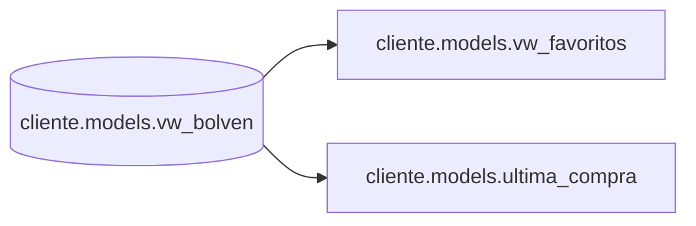

# Documentación - Proyecto cliente (Redshift)

## Alcance

Este repositorio contiene scripts SQL orientados a la construcción de **views** en el esquema `"cliente"."models"`.

## Inventario de objetos

- **View:** `"cliente"."models"."vw_favoritos"`
- **View:** `"cliente"."models"."ultima_compra"`

## Esquemas

- **Esquema lógico / destino:** `cliente.models`
- **Dependencia principal:** `cliente.models.vw_bolven`

## Diagramas

### Dependencias (alto nivel)

## Diccionario (resumen)

- **`vw_favoritos`**
  - **Grano:** 1 registro por `id_cliente_unificado`
  - **Propósito:** obtener atributos “favoritos” (top 1 por frecuencia) por cliente.

- **`ultima_compra`**
  - **Grano:** 1 registro por `id_cliente_unificado`
  - **Propósito:** obtener la última compra (por `dia_venta` más reciente) por cliente.
