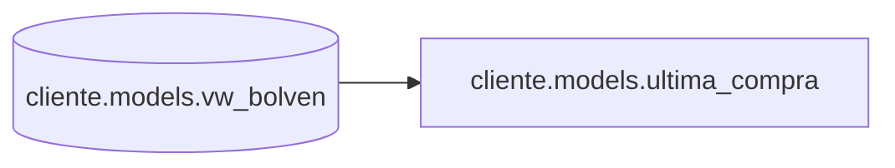

# View: `cliente.models.ultima_compra`

## Tipo

- **Objeto:** View
- **Nombre:** `"cliente"."models"."ultima_compra"`

## Descripción funcional

Devuelve, para cada `id_cliente_unificado`, la **última compra** según el `dia_venta` más reciente, usando `ROW_NUMBER()` para quedarnos con el registro `rn = 1`.

## Fuente(s) y dependencias

- **Fuente principal:** `"cliente"."models"."vw_bolven"`

### Diagrama de dependencias

## Lógica / reglas relevantes

- Se filtra `id_cliente_unificado IS NOT NULL`.
- Se calcula `rn = ROW_NUMBER() OVER (PARTITION BY id_cliente_unificado ORDER BY dia_venta DESC)`.
- Se selecciona `rn = 1` para obtener el registro más reciente por cliente.

## Diccionario de datos (salida de la view)

| Columna | Descripción |
|---|---|
| `id_cliente_unificado` | Identificador del cliente unificado (llave de grano: 1 fila por cliente). |
| `operacion` | Identificador/clave de operación asociada al registro de la última compra. |
| `marca` | Marca asociada a la última compra. |
| `mercado` | Mercado asociado a la última compra. |
| `clase_servicio` | Clase de servicio asociada a la última compra. |
| `ultima_fecha_viaje` | Fecha del viaje (`feccorrida`) del registro seleccionado como última compra. |
| `ultima_fecha_compra` | Fecha de compra (`dia_venta`) del registro seleccionado como última compra. |

## Notas

- El script contiene consultas de previsualización y un bloque transaccional (`BEGIN; ... COMMIT; ROLLBACK;`). La definición final es el `CREATE OR REPLACE VIEW`.
